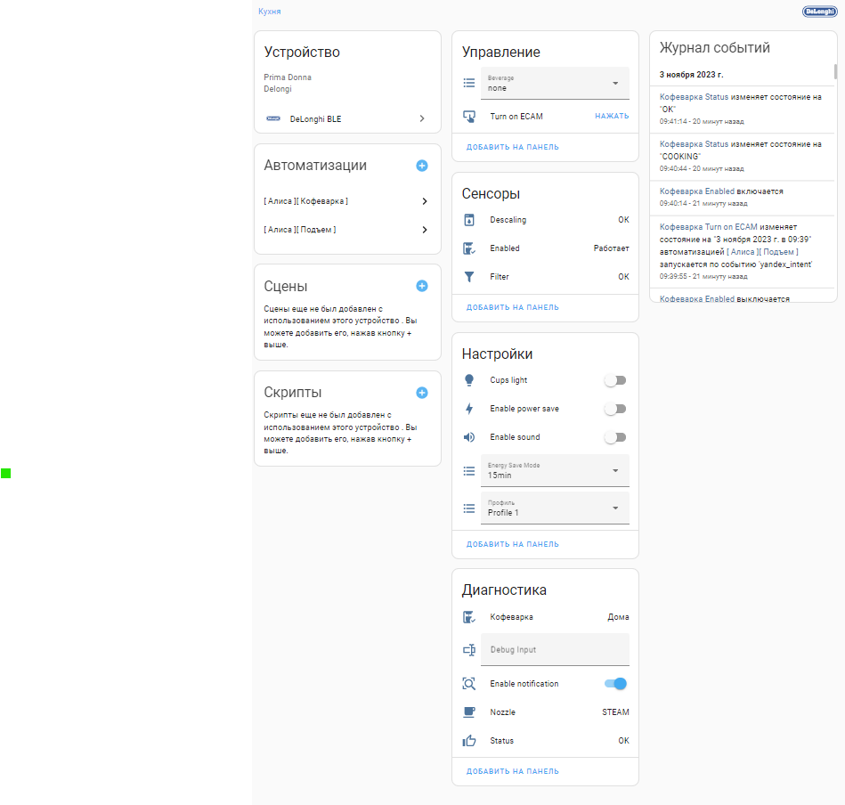

# Home assistant Delonghi integration

[](https://github.com/hacs/integration)
[](https://github.com/Arbuzov/home_assistant_delonghi_primadonna/blob/master/LICENSE)
[](https://github.com/Arbuzov/home_assistant_delonghi_primadonna/releases)
[](https://analytics.home-assistant.io/custom_integrations.json)


[](https://my.home-assistant.io/redirect/hacs_repository/?owner=Arbuzov&repository=home_assistant_delonghi_primadonna&category=integration)


[](https://my.home-assistant.io/redirect/config_flow_start/?domain=home_assistant_delonghi_primadonna)


## Known issues

* Delonghi device reports one status at once if you remove water tank first and than remove coffeecake container you got only one warning about the water
* Delonghi device supports only one connection. You could not connect to device using the native application if you use this integration.
* Delonghi device may not handle customer disconnection. Your device may die but dlonghi may think it`s still connected.

## Component to integrate Delonghi coffee machine into the Home Assistant

This component establishes persistent Bluetooth connection to send commands to cafe machine. If any parallel connection will be set the integration will not work.
### Events

This integration triggers events in case of device state is changed.

The event looks like following:

```
{
   'data' : "b'd0 12 75 0f 01 05 00 00 00 07 00 00 00 00 00 00 00 9d 61'"
   'type' : 'status'
   'description' : 'DeviceOK'
}
```
There is only two event type available status and process. The list of available events can be found [here](./custom_components/delonghi_primadonna/device.py#L69)

## Installation

#### HACS
[Add this repository into HACS as custom repository.](https://hacs.xyz/docs/faq/custom_repositories/)

[Install using HACS.](https://hacs.xyz/docs/navigation/overview)

#### Manual
Copy all files from this repository in custom_components/delonghi_primadonna to your <config directory>/custom_components/delonghi_primadonna/ directory.

## Configuration

* Find the device MAC address using BLE scanner or smartphone
* Open the integration page
* Click add integration
* Enter "Delonghi"
* Select "Delonghi Primadonna" integration
* Enter the name and the MAC address




## Compartible devices

* De'Longhi ECAM 550.55
* De'Longhi Dinamica Plus Class ECAM 370.95
* De'Longhi Maestosa EPAM 960.75.GLM
* De'Longhi ECAM 650.85.MS
* De'Longhi ECAM 550.55.W
* De'Longhi ECAM 650.55.MS EX:1
* De'Longhi ECAM 510.55M
* Feel free to add your model...
