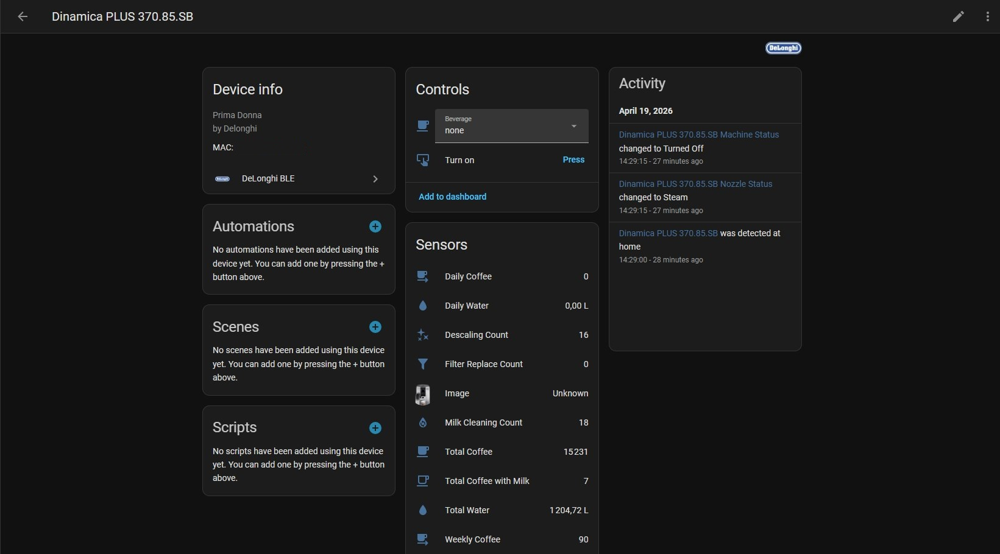
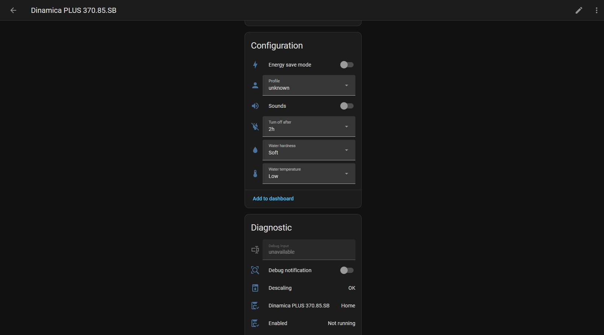
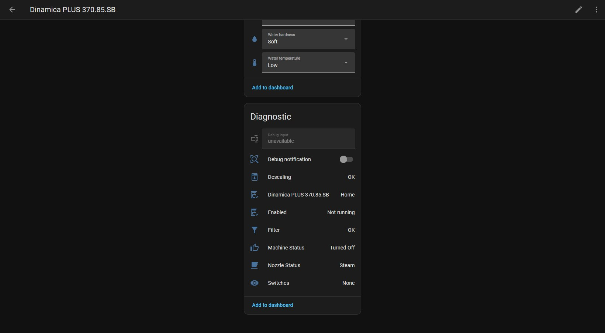

<div align="right">
  <details>
    <summary >🌐 Language</summary>
    <div>
      <div align="center">
        <a href="https://openaitx.github.io/view.html?user=Arbuzov&project=home_assistant_delonghi_primadonna&lang=en">English</a>
        | <a href="https://openaitx.github.io/view.html?user=Arbuzov&project=home_assistant_delonghi_primadonna&lang=zh-CN">简体中文</a>
        | <a href="https://openaitx.github.io/view.html?user=Arbuzov&project=home_assistant_delonghi_primadonna&lang=zh-TW">繁體中文</a>
        | <a href="https://openaitx.github.io/view.html?user=Arbuzov&project=home_assistant_delonghi_primadonna&lang=ja">日本語</a>
        | <a href="https://openaitx.github.io/view.html?user=Arbuzov&project=home_assistant_delonghi_primadonna&lang=ko">한국어</a>
        | <a href="https://openaitx.github.io/view.html?user=Arbuzov&project=home_assistant_delonghi_primadonna&lang=hi">हिन्दी</a>
        | <a href="https://openaitx.github.io/view.html?user=Arbuzov&project=home_assistant_delonghi_primadonna&lang=th">ไทย</a>
        | <a href="https://openaitx.github.io/view.html?user=Arbuzov&project=home_assistant_delonghi_primadonna&lang=fr">Français</a>
        | <a href="https://openaitx.github.io/view.html?user=Arbuzov&project=home_assistant_delonghi_primadonna&lang=de">Deutsch</a>
        | <a href="https://openaitx.github.io/view.html?user=Arbuzov&project=home_assistant_delonghi_primadonna&lang=es">Español</a>
        | <a href="https://openaitx.github.io/view.html?user=Arbuzov&project=home_assistant_delonghi_primadonna&lang=it">Italiano</a>
        | <a href="https://openaitx.github.io/view.html?user=Arbuzov&project=home_assistant_delonghi_primadonna&lang=ru">Русский</a>
        | <a href="https://openaitx.github.io/view.html?user=Arbuzov&project=home_assistant_delonghi_primadonna&lang=pt">Português</a>
        | <a href="https://openaitx.github.io/view.html?user=Arbuzov&project=home_assistant_delonghi_primadonna&lang=nl">Nederlands</a>
        | <a href="https://openaitx.github.io/view.html?user=Arbuzov&project=home_assistant_delonghi_primadonna&lang=pl">Polski</a>
        | <a href="https://openaitx.github.io/view.html?user=Arbuzov&project=home_assistant_delonghi_primadonna&lang=ar">العربية</a>
        | <a href="https://openaitx.github.io/view.html?user=Arbuzov&project=home_assistant_delonghi_primadonna&lang=fa">فارسی</a>
        | <a href="https://openaitx.github.io/view.html?user=Arbuzov&project=home_assistant_delonghi_primadonna&lang=tr">Türkçe</a>
        | <a href="https://openaitx.github.io/view.html?user=Arbuzov&project=home_assistant_delonghi_primadonna&lang=vi">Tiếng Việt</a>
        | <a href="https://openaitx.github.io/view.html?user=Arbuzov&project=home_assistant_delonghi_primadonna&lang=id">Bahasa Indonesia</a>
        | <a href="https://openaitx.github.io/view.html?user=Arbuzov&project=home_assistant_delonghi_primadonna&lang=as">অসমীয়া</
      </div>
    </div>
  </details>
</div>

# Home assistant Delonghi integration

[](https://github.com/hacs/integration)
[](https://github.com/Arbuzov/home_assistant_delonghi_primadonna/blob/master/LICENSE)
[](https://github.com/Arbuzov/home_assistant_delonghi_primadonna/releases)
[](https://analytics.home-assistant.io/custom_integrations.json)
[](https://github.com/Arbuzov/home_assistant_delonghi_primadonna/actions/workflows/validate.yml)
[](https://github.com/Arbuzov/home_assistant_delonghi_primadonna/stargazers)
[](https://github.com/Arbuzov/home_assistant_delonghi_primadonna/commits/master)


[](https://my.home-assistant.io/redirect/hacs_repository/?owner=Arbuzov&repository=home_assistant_delonghi_primadonna&category=integration)


[](https://my.home-assistant.io/redirect/config_flow_start/?domain=home_assistant_delonghi_primadonna)


## Known issues

* Delonghi device reports one status at a time: if you remove the water tank first and then remove the coffee grounds container, you get only one warning about the water.
* Delonghi devices support only one connection. You cannot connect to the device using the native application while this integration is active.
* Delonghi device may not handle client disconnections or unexpected connection loss. If the Home Assistant connection drops (for example, due to network issues or the host going offline), the coffee machine may still think it's connected.

## Component to integrate Delonghi coffee machine into the Home Assistant

This component establishes persistent Bluetooth connection to send commands to cafe machine. If any parallel connection will be set the integration will not work.
### Events

This integration triggers events in case of device state is changed.

The event looks like following:

```
{
   'data' : "b'd0 12 75 0f 01 05 00 00 00 07 00 00 00 00 00 00 00 9d 61'"
   'type' : 'status'
   'description' : 'DeviceOK'
}
```
There is only two event type available status and process. The list of available events can be found [here](./custom_components/delonghi_primadonna/device.py#L69)

## Installation

#### HACS
[Add this repository into HACS as custom repository.](https://hacs.xyz/docs/faq/custom_repositories/)

[Install using HACS.](https://hacs.xyz/docs/navigation/overview)

#### Manual
Copy all files from this repository in custom_components/delonghi_primadonna to your <config directory>/custom_components/delonghi_primadonna/ directory.

## Configuration

* Find the device MAC address using BLE scanner or smartphone
* Open the integration page
* Click add integration
* Enter "Delonghi"
* Select "Delonghi Primadonna" integration
* Enter the name and the MAC address
* To change these settings later open the integration options and update the
  values





## Compatible devices

* De'Longhi ECAM 550.55
* De'Longhi Dinamica Plus Class ECAM 370.85.SB
* De'Longhi Dinamica Plus Class ECAM 370.95
* De'Longhi Maestosa EPAM 960.75.GLM
* De'Longhi ECAM 650.85.MS
* De'Longhi ECAM 550.55.W
* De'Longhi ECAM 650.55.MS EX:1
* De'Longhi ECAM 510.55M
* Feel free to add your model...
